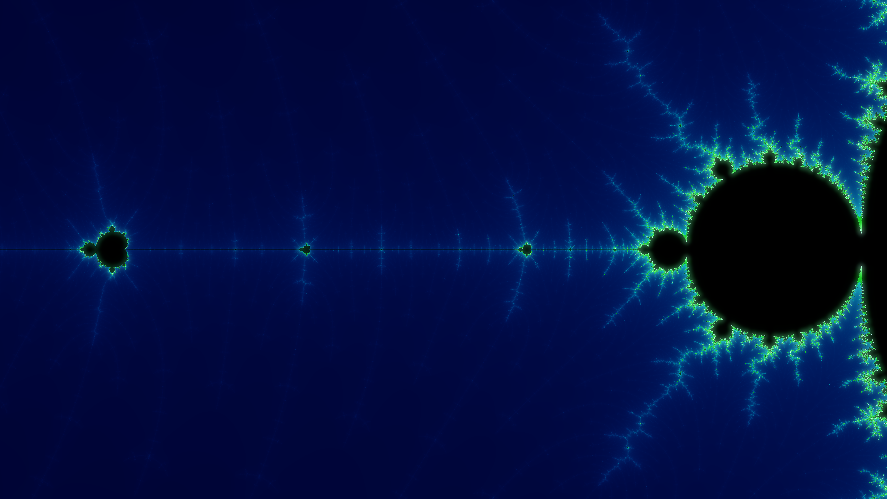

# mrenderer

A high-performance Mandelbrot set renderer for the terminal.

## Description

`mrenderer` is a Rust-based tool that renders the Mandelbrot set directly in your terminal using ANSI escape codes. It leverages `crossterm` for terminal manipulation and `num-complex` for the underlying fractal mathematics.

## Features

- **Terminal-based rendering**: View the beauty of the Mandelbrot set without leaving your shell.
- **Efficient buffering**: Optimized string buffering to reduce flicker and improve render speed.
- **Dynamic sizing**: Automatically adjusts to your current terminal dimensions.

## Installation

Ensure you have the Rust toolchain installed. You can then build the project using Cargo:

```bash
cargo build --release
```

## Usage

Run the compiled binary:

```bash
./target/release/mrenderer
```

## Screenshot



## License

This project is licensed under the terms found in the `LICENSE` file.
